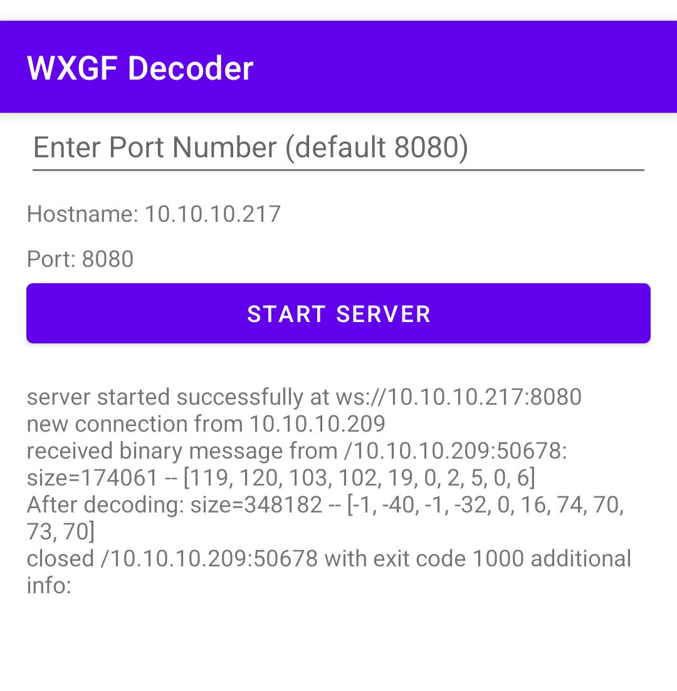

# WXGF Decoder

This is an android app that decodes wechat's proprietary "WXGF/WXAM" image format.

## Build & Install

Open this project directory using android studio, and build against an ARMv8 device.

Pre-built APKs can be downloaded at [releases](https://github.com/ppwwyyxx/wechat-dump/releases).

Install the APK to your android phone.

Note that this app uses native libs, therefore requires an ARMv8 compatible device to run.
The native libs are extracted from the WeChat v7.0.22 APK downloaded from [here](https://www.apkmirror.com/apk/wechat-tencent/wechat/wechat-7-0-22-release/wechat-7-0-22-android-apk-download/)

## Use

1. (Optional) Configure the port number if needed, or leave it to default.
2. Click "Start Server"
3. Use the server address `ws://xx.xx.xx.xx:xxxx` to decode
   * Make sure this address is accessible from the computer that runs `wechat-dump`.
     For example, connect them into the same Wifi.
4. Once a client is connected and decoding request is received, logs will be printed in the app.
